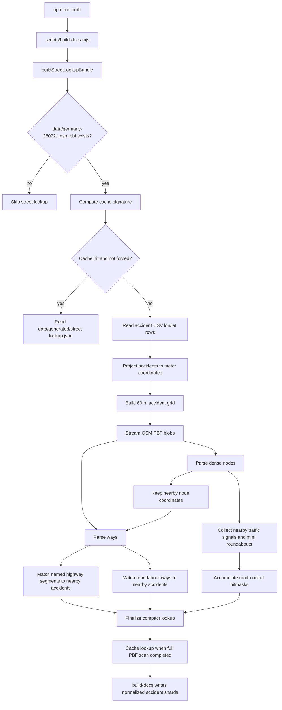

# Street Lookup Build Pipeline

`scripts/build-streets.mjs` builds the temporary OpenStreetMap lookup used by `scripts/build-docs.mjs` while normalizing accident records. The generated lookup is cached locally at `data/generated/street-lookup.json`; it is not shipped to the browser because the normalized accident shards already contain the derived street names and road-control flags.

## Flow



## Stages

| Stage | Main functions | What it does |
| --- | --- | --- |
| Input discovery | `buildStreetLookupBundle`, `streetLookupSignature` | Locates the local PBF, computes the cache key from CSV metadata and PBF metadata, and optionally bypasses the cache with `SICHERE_KNOTEN_STREET_FORCE_REBUILD=1`. |
| Accident index | `readAccidentSource`, `buildAccidentGrid` | Reads valid CSV coordinates, projects them to approximate meters, and stores accident indexes in a compact 60 m grid so OSM nodes and way segments only check nearby accidents. |
| PBF streaming | `matchStreetsFromPbf`, `processPrimitiveBlock`, `processPrimitiveGroup` | Reads the PBF blob by blob. Dense-node groups are processed before ways, because ways only contain node ids and need the nearby node coordinate store first. |
| Dense nodes | `processDenseNodes`, `createDenseNodeProcessor` | Decodes delta-compressed dense node ids and coordinates. Nodes close to accidents are retained in `nodeCoords`; traffic signals and mini roundabouts are matched directly as point controls. Worker threads can parallelize this stage. |
| Ways | `processWay`, `processWayRefs`, `osmMetadataForWay` | Decodes highway metadata and ordered node refs. Segment matching uses only refs whose node coordinates were retained during dense-node processing. |
| Final bundle | `finalizeStreetLookup`, `topStreetNamesForAccident` | Builds one street-name dictionary, per-row street-name indexes, and per-row OSM road-control bitmasks for build-time normalization. |

## Ordering Rules

The important dependency is:

```text
dense nodes near accidents -> node coordinate store -> way segment matching
```

`processPrimitiveGroup` drains pending dense-node work before processing a way. If dense-node worker processing fails, the build should fail rather than continue with an incomplete node coordinate store.

Way refs may be encoded as packed or unpacked repeated protobuf fields. `processWay` records ref parts in wire order, and `processWayRefs` replays them in that same order so mixed encodings do not change the geometry.

## Useful Test Flags

```powershell
$env:SICHERE_KNOTEN_STREET_FORCE_REBUILD = "1" # ignore data/generated/street-lookup.json
$env:SICHERE_KNOTEN_STREET_WORKERS = "0"       # run dense-node processing on the main thread
$env:SICHERE_KNOTEN_STREET_MAX_BLOBS = "100"  # stop early for a fast partial scan; result is not cached
npm run build
```

Clear the flags after testing with `Remove-Item Env:SICHERE_KNOTEN_STREET_FORCE_REBUILD`, and similarly for the other variables.
